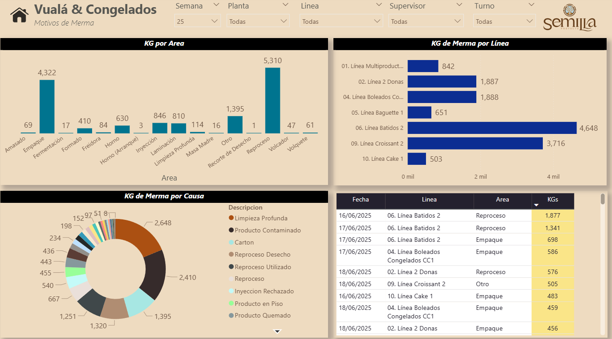

# 📊 Dashboard Merma - Power BI

Este repositorio contiene un ejemplo real de implementación de un dashboard de Power BI conectado a Power Apps, orientado al análisis de los motivos y cantidades de merma en una línea de producción.

---

## 📌 Objetivo

Diseñar un tablero en Power BI para medir y visualizar los resultados de los registros de merma en planta para llevar a cabo un análisis detallado de motivos de merma, módulos con mayor cantidad de merma y trazabilidad de los kilogramos mermados.

---

## 🛠️ Tecnologías Utilizadas

- Power BI Desktop (DirectQuery)
- Power Apps (Consultas a vistas y tablas en producción)
- DAX (Medidas complejas para disponibilidad, eficiencia, forecast, etc.)
- GitHub (para control de versiones y documentación técnica)

---

## 📁 Estructura del Repositorio

```plaintext
Merma/
├── pbix/                                   → Archivo PBIX del tablero
├── docs/
│   ├── README.md                           → Descripción general del repositorio
│   ├── Medidas.md                          → Medidas DAX documentadas
│   ├── Columnas_Calculadas.md              → DAX documentadas
│   ├── Tablas_Catalogo.md                   → DAX documentadas
│   ├── Instructivo Dashboard OEE.docx      → Guía de uso del dashboard
├── img/
│   ├── preview_dashboard.png               → Captura del dashboard
│   └── modelo_datos.png                    → Relación entre tablas
└── LICENSE                                 → MIT (u otra que se defina)
```

---

## 📷 Preview del Dashboard



---

## 📎 Cómo utilizarlo

1. Clona este repositorio.
2. Abre el archivo `pbix/Dashboard_OEE_Coflex.pbix` con Power BI Desktop.
3. Conecta tu fuente de datos o consulta en SQL Server.
4. Revisa la documentación en `/docs` para entender cada fórmula y estructura.

---

## 📄 Licencia

MIT – Libre uso con atribución.
